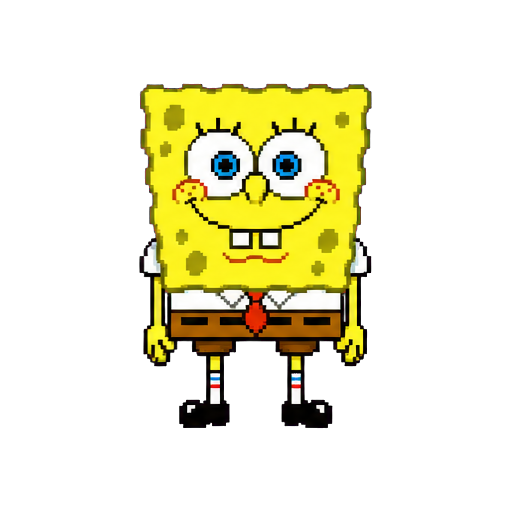
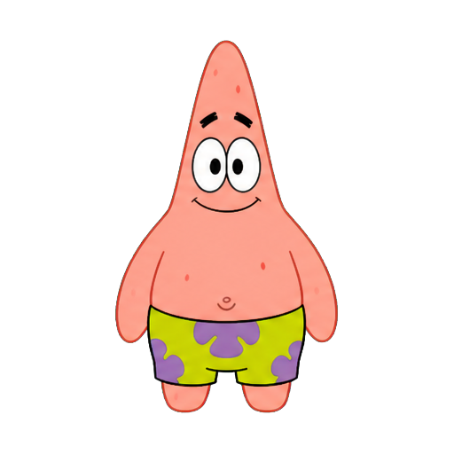
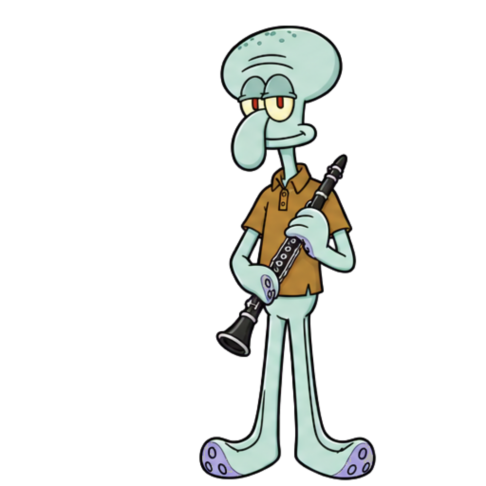
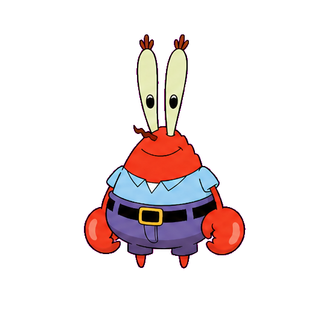

<div align="center">

# 🌊 OceanPet

### 住在 Mac 桌面上的角色化 AI 宠物

会看向你的鼠标、在家附近散步、听到名字醒来，
还能通过 DeepSeek 用角色自己的性格和你聊天。


</div>

OceanPet 是一款原生 macOS 桌面宠物。它以透明悬浮窗口常驻桌面，不占用 Dock，
可以在固定范围内散步、追随鼠标视线、播放表情动作，并通过 DeepSeek 与用户进行
符合角色性格的对话。

项目使用 Swift、AppKit、SpriteKit 和 SwiftUI 编写，不是网页应用，也不需要启动
本地服务器。聊天记录、角色包、API 配置和本地笔记索引均保存在用户自己的 Mac 上。

<table align="center">
  <tr>
    <td align="center">
      <br />
      <strong>卡通海绵宝宝</strong>
    </td>
    <td align="center">
      <br />
      <strong>卡通派大星</strong>
    </td>
    <td align="center">
      <br />
      <strong>卡通章鱼哥</strong>
    </td>
  </tr>
</table>

<table align="center">
  <tr>
    <td align="center">
      <br />
      <strong>蒙面鱼</strong>
    </td>
    <td align="center">
      <br />
      <strong>卡通蟹老板</strong>
    </td>
  </tr>
</table>

> 本项目适合个人学习、桌面交互实验和非商业用途。仓库中的角色形象有独立的权利说明，
> 不包含在项目的 MIT 代码许可证中。

## 为什么做 OceanPet

很多桌面助手只在被打开时存在，普通桌宠又很难真正参与日常使用。OceanPet 希望把
“一直陪在桌面上的角色”和“随时可以交流的 AI”放在同一个轻量窗口里：不打断当前工作，
需要时双击、说话或喊名字就能交流，平时则安静地在附近活动。

## 核心功能

| 能力 | 说明 |
| --- | --- |
| 🪟 **原生桌面悬浮** | 透明无边框窗口，不显示 Dock 图标，可跨桌面空间和全屏应用显示 |
| 👀 **视线跟随** | 海绵宝宝的眼睛平滑追随鼠标，并通过眼白范围限制避免眼球越界 |
| 🐾 **附近散步** | 只在“家”左右固定范围内移动，带加速、减速和自动回家，不会越走越远 |
| 🖱️ **自然交互** | 单击反馈、双击聊天、拖动搬家、右键菜单；透明区域支持点击穿透 |
| 💬 **角色化对话** | 接入 DeepSeek API，根据角色提示词回复，并使用回复情绪驱动表情动作 |
| 🎤 **多种语音入口** | 聊天框麦克风、全局 `Option + Space` 按住说话、当前角色名字语音唤醒 |
| 📓 **本地笔记问答** | 在本机检索 Obsidian Markdown 笔记，只把相关片段加入当次对话 |
| 🎭 **可扩展角色包** | 支持 4×2 基础动画表和多帧扩展步态；角色名字、唤醒词、性格和渲染方式随包配置 |
| 🚀 **开机启动** | 可从右键菜单开启或关闭登录后自动运行 |
| 🔒 **本地数据** | API 配置、聊天记录和导入角色均保存在用户自己的应用支持目录 |

## 系统要求

- macOS 14 或更高版本
- Swift 5.10 或更高版本
- 可用的 DeepSeek API Key
- 语音功能需要开启 macOS“听写”，并允许麦克风和语音识别权限

## 快速开始

克隆并运行：

```bash
git clone https://github.com/cpp285/OceanPet.git
cd OceanPet
swift run OceanPet
```

如需生成可直接双击运行的应用：

```bash
./scripts/build-app.sh
open dist/OceanPet.app
```

打包结果位于 `dist/OceanPet.app`。`.build/` 和 `dist/` 已被 `.gitignore` 排除，
不会随源码提交到 GitHub。

## 配置 DeepSeek

OceanPet 首次启动时会创建本机配置文件：

```text
~/Library/Application Support/OceanPet/config.json
```

右键桌宠，选择“打开 DeepSeek 配置文件…”，然后填写：

```json
{
  "deepseek": {
    "apiKey": "你的 API Key",
    "baseURL": "https://api.deepseek.com",
    "model": "deepseek-v4-flash"
  }
}
```

保存文件后无需重启。OceanPet 每次发送消息前都会重新读取配置。

也可以使用以下环境变量临时覆盖文件设置：

- `DEEPSEEK_API_KEY`
- `DEEPSEEK_BASE_URL`
- `DEEPSEEK_MODEL`

API Key 不会写入项目目录或聊天记录。它以明文保存在当前用户的应用支持目录中，
文件权限会限制为仅当前用户可读写。请勿把 Key、配置文件或包含 Key 的截图提交到 GitHub。

## 使用方式

| 操作 | 效果 |
| --- | --- |
| 单击宠物 | 播放轻微反馈动作 |
| 双击宠物 | 打开或关闭聊天窗口 |
| 拖动宠物 | 移动位置，松手处成为新的“家” |
| 右键宠物 | 打开功能菜单 |
| 聊天框麦克风 | 语音输入并自动发送 |
| 按住 `Option + Space` | 在其他应用中开始说话，松开后发送 |
| `Esc` | 关闭聊天窗口 |

语音唤醒默认关闭。开启后，说出当前角色名字即可打开聊天并继续讲话。切换角色时，
菜单提示、输入框占位文字和实际唤醒词会一起更新。

如果系统提示听写已关闭，请进入：

```text
系统设置 → 键盘 → 听写
```

## 本地笔记

右键菜单中的“本地笔记”可以选择一个 Obsidian 知识库。OceanPet 只在本机搜索
Markdown 文件，并仅把与当前问题相关的少量片段加入当次 DeepSeek 请求。

停用本地笔记后，不会再搜索或发送笔记内容。

## 实现方式

- **桌面窗口**：AppKit `NSPanel` 提供透明、无边框、非激活和跨空间悬浮窗口
- **角色动画**：SpriteKit 切分精灵表并播放状态帧，分别支持像素硬边和平滑二维素材
- **移动效果**：按屏幕刷新节奏更新位置，使用连续速度插值和完整人物交替步态控制散步与回家
- **点击穿透**：读取当前精灵帧的透明度，只让角色身体区域接收鼠标事件
- **眼睛跟随**：根据桌面鼠标位置计算注视方向，动态重绘受约束的瞳孔区域
- **AI 对话**：使用原生 `URLSession` 请求 DeepSeek，并把文字回复和情绪状态一起解析
- **语音交互**：使用 macOS Speech 与 AVFoundation 完成语音识别、按住说话和语音唤醒
- **本地笔记**：轻量扫描 Markdown，按标题和查询词相关度选取少量片段加入当前问题

## 自定义角色

角色包是一个独立目录，至少包含：

```text
MyCharacter/
├── pet.json
└── spritesheet.png
```

通过右键菜单中的“导入角色包…”选择该目录。导入后，角色包会复制到：

```text
~/Library/Application Support/OceanPet/Characters/
```

基础角色包可以采用 4×2 网格，八个默认单元依次表示：

1. 待机
2. 眨眼
3. 说话
4. 开心
5. 向左走
6. 向右走
7. 困惑
8. 犯困

`pet.json` 示例：

```json
{
  "id": "my-character",
  "displayName": "我的角色",
  "spokenName": "角色名字",
  "wakeWords": ["角色名字"],
  "spriteSheet": "spritesheet.png",
  "pixelArt": false,
  "grid": { "columns": 4, "rows": 2 },
  "stateFrames": {
    "idle": [0, 1],
    "talking": [2, 0],
    "happy": [3],
    "walkLeft": [4],
    "walkRight": [5],
    "confused": [6],
    "sleepy": [7]
  },
  "frameDuration": 0.24,
  "persona": {
    "greeting": "你好！",
    "systemPrompt": "在这里描述角色性格与回复格式。"
  }
}
```

- `spokenName`：聊天输入框和菜单中显示的名字
- `wakeWords`：可接受的语音唤醒词，可以填写多个
- `pixelArt`：像素素材设为 `true`，普通二维动画素材设为 `false`
- `stateFrames`：每个状态使用的精灵格序号；填写多个序号可形成循环动画
- `walkFrameDuration`：可选，单独控制走路帧速度；内置角色使用完整人物左右脚交替步态
- `persona`：角色问候语和 DeepSeek 性格提示词

## 数据与隐私

OceanPet 会在以下目录保存运行数据：

```text
~/Library/Application Support/OceanPet/
```

其中可能包含：

- `config.json`：DeepSeek 配置和 API Key
- `conversation.json`：本地聊天记录
- `Characters/`：用户导入的角色包

文本聊天会发送给配置的 DeepSeek API。启用本地笔记时，相关笔记片段也会随当次请求发送。
除这些明确的对话请求外，项目不包含账号系统、遥测统计或远程数据库。

## 项目结构

```text
OceanPet/
├── Sources/OceanPet/
│   ├── App/          # 应用启动与右键菜单
│   ├── Chat/         # 聊天窗口和状态管理
│   ├── Models/       # 对话与角色数据模型
│   ├── Pet/          # 桌宠窗口、动画、移动与视线追踪
│   ├── Resources/    # 内置角色包
│   └── Services/     # DeepSeek、语音、配置、笔记与持久化
├── Tests/            # 单元测试
├── Support/          # macOS 应用配置
├── Assets/           # 素材生成记录与中间资源
└── scripts/          # 应用打包脚本
```

## 测试

```bash
swift test
```

测试覆盖角色包加载、DeepSeek 请求与重试、配置文件读取、本地笔记检索、透明区域点击、
眼球范围和宠物移动边界。

## 许可证

项目源码采用 [MIT License](LICENSE)。角色形象和素材不属于 MIT 许可证范围，详见
[THIRD_PARTY_NOTICES.md](THIRD_PARTY_NOTICES.md)。
